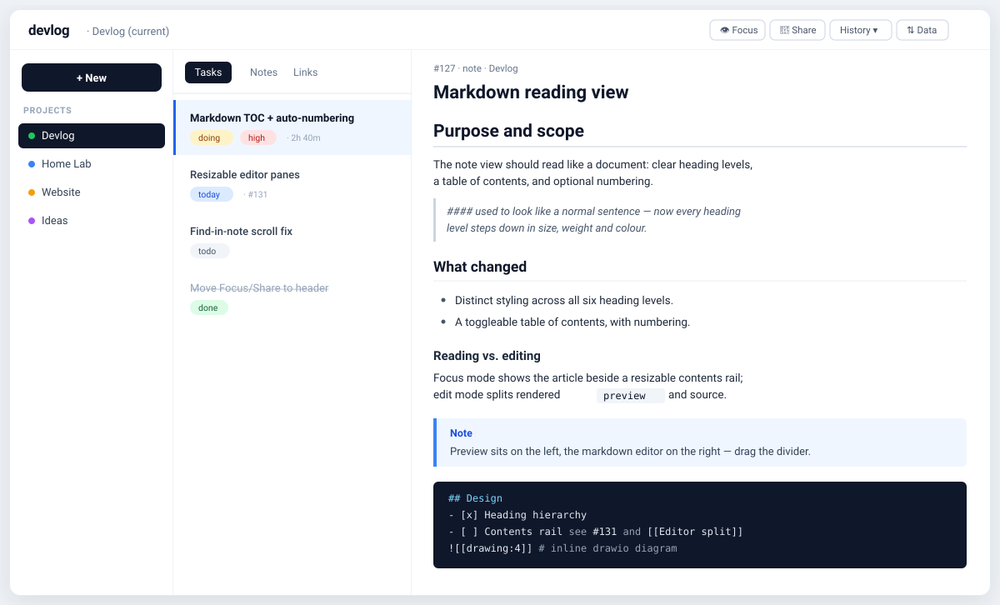

# devlog

Local-first developer **task / note / link tracker** — one SQLite file, a FastAPI backend, a fast vanilla-JS web UI, native desktop apps, and an MCP server so an LLM can drive it all.



<!-- Prefer a real screenshot or short GIF? Drop it in docs/ and swap the line above:
           ·       -->

- **Tasks · notes · links** scoped to projects, with cross-refs (`#42`, `[[Title]]`), tags, and full-text search.
- **A document-grade markdown view** — heading hierarchy, a toggleable table of contents with optional numbering, footnotes, task lists, admonitions, code highlighting, and Mermaid.
- **Time tracking** — one task "doing" at a time, editable sessions, end-of-workday auto-pause.
- **Drawings** — a vendored, fully-offline drawio; `![[drawing:N]]` renders inline.
- **MCP server** — `devlog-mcp` exposes 18 tools so Claude can create and search everything.

---

## Run it

Devlog is a small backend plus a web UI. The nicest way to use it day-to-day is a **native desktop app**; if you just want to try it, one Docker command gets you there.

### macOS — native app (recommended)

A real macOS window hosting the full UI (native Find, save/open panels, its own Dock icon).

```bash
git clone https://github.com/morapet/devlog.git
cd devlog
make install     # one-time: backend deps via uv
make dev &       # start the backend on http://127.0.0.1:8765  (leave it running)
make mac         # build + open the app  (needs Xcode Command Line Tools)
```

The app opens in **Connect** mode and talks to `http://127.0.0.1:8765` with zero config. To keep it around: `make mac-install` copies **Devlog.app** into `/Applications` (`make mac-dmg` builds a drag-to-Applications installer).

> Want the backend to start on login so you don't run `make dev`? See **[More ways to run the backend](#more-ways-to-run-the-backend)** below (Docker with `--restart`, or a service). Then just open the app.

### Linux — native app

```bash
make app-linux   # GTK3 + WebKit2GTK window, apt-installs deps, adds autostart
```

Pairs well with the systemd backend service (see below) for a run-on-login setup: `make install-linux` does both.

### Any OS — just the web UI (no app to build)

Fastest path, no clone, no build — the prebuilt image from GHCR (drawio baked in):

```bash
docker run -d --name devlog -p 8765:8765 -v ~/devlog-data:/data \
    --restart unless-stopped ghcr.io/morapet/devlog:latest
open http://localhost:8765      # or just visit it in a browser
```

The web UI is also an installable PWA — in the browser, use *Install app* / *Add to Home Screen*.

---

<details>
<summary><b>More ways to run the backend</b> — Docker Compose, uv, CLI tool, systemd</summary>

### Docker Compose (published image)

Drop this in a directory as `docker-compose.yml`:

```yaml
services:
  devlog:
    image: ghcr.io/morapet/devlog:latest
    container_name: devlog
    ports: ["8765:8765"]
    volumes: ["./data:/data"]
    restart: unless-stopped
```

```bash
docker compose up -d
```

Update later: `docker pull ghcr.io/morapet/devlog:latest && docker rm -f devlog` then re-run.

Image tags: `latest` / `main` (newest push to `main`), `v1.2.3` / `1.2` / `1` (semver tags), `sha-abc1234` (a commit).

### Docker from source

```bash
git clone https://github.com/morapet/devlog.git && cd devlog
make docker-up          # builds the image (includes drawio) and starts it
```

Data persists in `./data/`. Stop with `make docker-down`.

### Local Python with [uv](https://docs.astral.sh/uv/)

```bash
git clone https://github.com/morapet/devlog.git && cd devlog
make install            # uv sync
make drawio             # download the drawio webapp (~120 MB, one-time, optional)
make dev                # uv run devlog  →  http://127.0.0.1:8765
```

Data lives at `~/.local/share/devlog/devlog.db` (or `$XDG_DATA_HOME/devlog/`).

### Install as a CLI tool

```bash
uv tool install git+https://github.com/morapet/devlog.git
devlog                  # start the backend
bash $(uv tool dir)/devlog/scripts/install-drawio.sh   # optional: drawings
```

### Ubuntu / Debian — run on every login (systemd user service)

```bash
make install-linux      # backend service + desktop app, all-in-one (from a checkout)

# …or just the backend, from anywhere, no checkout:
curl -sLf https://raw.githubusercontent.com/morapet/devlog/main/clients/linux-server/install.sh \
    | bash -s -- --from-github --linger
```

Installs the package, downloads drawio, writes `~/.config/systemd/user/devlog.service`, and (with `--linger`) keeps it running after logout. See [clients/linux-server/README.md](clients/linux-server/README.md).

</details>

<details>
<summary><b>Use it from your phone</b> — LAN, Tailscale, or on-device</summary>

The web UI is a mobile PWA; run the backend anywhere your phone can reach it and *Add to Home Screen* for a native-app feel. There's no iOS build to install — Safari is the client.

- **Same Wi-Fi:** bind the backend to the network (`DEVLOG_HOST=0.0.0.0 make dev`; Docker already does), find the machine's IP (`ipconfig getifaddr en0` / `hostname -I`), and open `http://<ip>:8765`.
- **Anywhere — [Tailscale](https://tailscale.com):** install it on both devices, then `http://<machine-name>:8765`. For HTTPS (needed for the offline service worker): `tailscale serve --bg 8765`.
- **No computer at all:** run the backend *on* the iPhone inside [iSH](https://ish.app) — see [clients/ios/README.md](clients/ios/README.md).

</details>

<details>
<summary><b>Host it on the internet</b> — HTTPS + login</summary>

Devlog ships built-in auth: loopback is trusted, remote devices need a shared secret (`DEVLOG_AUTH_TOKEN`, or auto-generated to `<data_dir>/auth.token` — print with `devlog --print-token`). `DEVLOG_AUTH=always` requires it everywhere; `DEVLOG_AUTH=off` disables it (never do that on an open port). The web UI prompts once and keeps a 30-day cookie; API clients send `Authorization: Bearer <token>`. Ready-made setups, all serving the PWA with offline support:

- [deploy/cloudflare/](deploy/cloudflare/README.md) — **Cloudflare Tunnel**, free, zero open ports; optional Cloudflare Access on top.
- [deploy/vps-caddy/](deploy/vps-caddy/README.md) — **VPS + Caddy**, automatic Let's Encrypt certs.
- [deploy/pythonanywhere/](deploy/pythonanywhere/README.md) — **PythonAnywhere**, free tier, no server admin.
- [deploy/cloud-run/](deploy/cloud-run/README.md) — **Google Cloud Run**, scale-to-zero; SQLite persisted via Litestream.

</details>

---

## MCP server

Exposes the HTTP API as 18 MCP tools for Claude Desktop / Claude Code. Add to your client config (e.g. `~/.claude.json`):

```json
{
  "mcpServers": {
    "devlog": {
      "command": "uv",
      "args": ["run", "--directory", "/path/to/devlog", "devlog-mcp"]
    }
  }
}
```

Override the backend URL with `DEVLOG_BASE_URL`. Full tool list: [src/devlog/mcp_server.py](src/devlog/mcp_server.py).

## Configuration

| Env var | Default | Meaning |
|---|---|---|
| `DEVLOG_HOST` | `127.0.0.1` | Bind address (`0.0.0.0` in Docker / to reach from other devices) |
| `DEVLOG_PORT` | `8765` | Bind port |
| `DEVLOG_DATA_DIR` | `$XDG_DATA_HOME/devlog` or `~/.local/share/devlog` | Where the SQLite file lives |
| `DEVLOG_BASE_URL` | `http://127.0.0.1:8765` | Used by `devlog-mcp` to reach the backend |
| `DEVLOG_AUTH` | `auto` | `auto` trusts loopback, requires the token remotely; `always` everywhere; `off` disables |
| `DEVLOG_AUTH_TOKEN` | *(auto-generated)* | Shared secret for remote access; `devlog --print-token` |

<details>
<summary>Make targets &amp; project layout</summary>

```
make help          # list every target
make install       # python deps via uv
make drawio        # download drawio webapp
make dev           # run the backend
make mac           # build + launch the macOS app
make mac-install   # build + install Devlog.app into /Applications
make app-linux     # install the Linux desktop app
make mcp           # run devlog-mcp (stdio)
make docker-up     # docker compose up -d   (docker-down / docker-logs / docker-build)
make clean         # remove build artifacts (keeps data + db)
```

```
src/devlog/          FastAPI app + web assets
  api/               routers: projects, items, sessions, attachments, search, stats, settings
  web/               index.html, app.js, style.css, vendor/drawio/ (ignored)
  db.py              schema + thread-local connections + migrations
  mcp_server.py      FastMCP wrapper (18 tools)
clients/mac-app/     SwiftUI native app (WKWebView)
clients/linux-app/   GTK3 + WebKit2GTK app
deploy/              cloudflare · vps-caddy · pythonanywhere · cloud-run
Dockerfile · docker-compose.yml · Makefile · pyproject.toml
```

</details>

## Stack

- **Backend** — FastAPI · SQLite (WAL + FTS5) · httpx · selectolax
- **Web UI** — vanilla JS · Tailwind (CDN) · markdown-it (+ custom plugins) · highlight.js · Mermaid · drawio
- **macOS** — SwiftUI · WKWebView · async/await URLSession · **Linux** — GTK3 · WebKit2GTK
- **MCP** — `mcp` Python SDK (FastMCP, stdio)

## Documentation

- [ARCHITECTURE.md](ARCHITECTURE.md) — system diagram, process model, rendering pipeline, what each client does.
- [AGENTS.md](AGENTS.md) — operating guide for LLMs: MCP connection, workflows mapped to tool calls, the drawio recipe.
- [SPECIFICATION.md](SPECIFICATION.md) — exhaustive contract: domain model, every endpoint, every invariant.

## License

[MIT](LICENSE)
